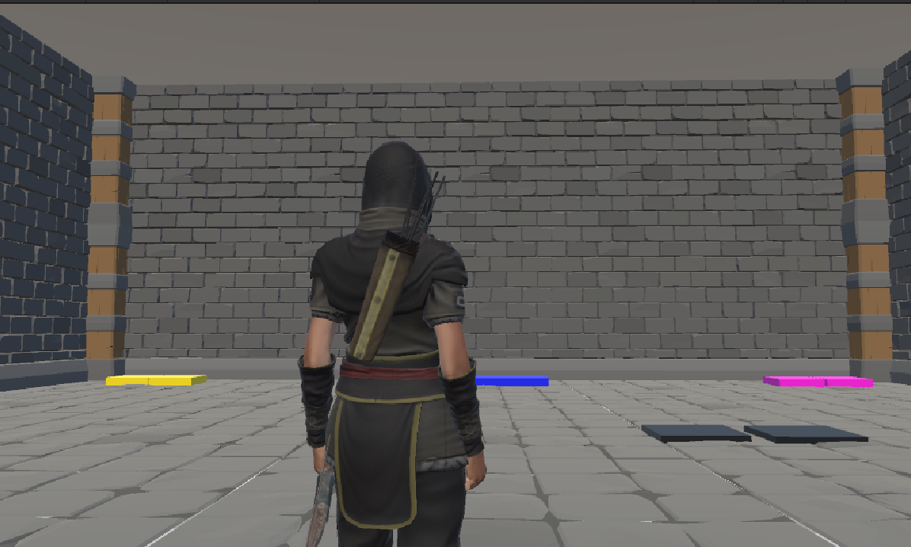
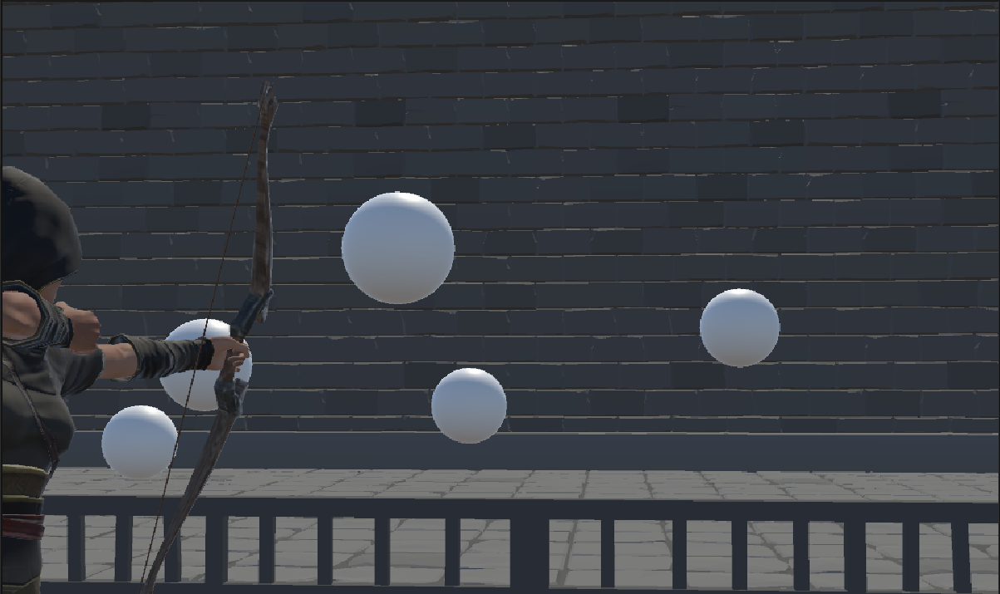

# Archer's Quest

Genre: Adventure/Strategy

A fun and engaging game concept that challenges different player skills, making the choices strategically based on the skills they want to develop.

## Table of Contents

- [Game Overview](#overview)
- [Game](#game)
- [Team](#team)

## Overview

Players will need to choose wisely which skills to pursue based on their gameplay style or the challenges they anticipate facing with the final boss.

Starting Equipment: Each player begins with a basic bow and a set of arrows.

Fields: Each of the six fields tests different skills:

- Catch the Capsule: Requires precision and timing to catch moving targets.
- Maze Runner: Focuses on navigation and quick decision-making.
- Shooting Arena: Focuses on refining the player's aiming and shooting skills.

Skill Acquisition: Players choose only two fields to enter and gain skills or items that will significantly influence their abilities in the final battle.

Final Boss: After acquiring skills, players face a challenging boss that requires a combination of the skills learned.

## Game 

Teleport:

Shooting Arena:

Maze Runner:
<video width="1000" height="700" controls><source src="images/image3.mp4" type="video/mp4"></video>

Catch the Capsule:
<video width="1000" height="700" controls><source src="images/image4.mp4" type="video/mp4"></video>

Final Boss:
<video width="1000" height="700" controls><source src="images/image5.mp4" type="video/mp4"></video>

## Team

ICS691E Project 2 is designed, implemented, and maintained by a team consisting of three members:

> Hok Wai Chan, a computer science student at the University of Hawaii at Manoa.
>
> 

> Jingyi He, a computer science student at the University of Hawaii at Manoa.
>
> 

> Adrian Tam, a computer science student at the University of Hawaii at Manoa.
>
> 
